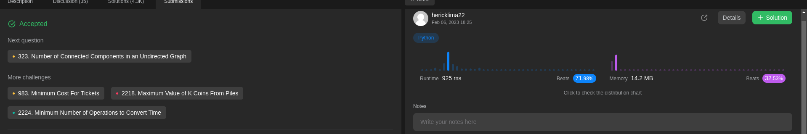
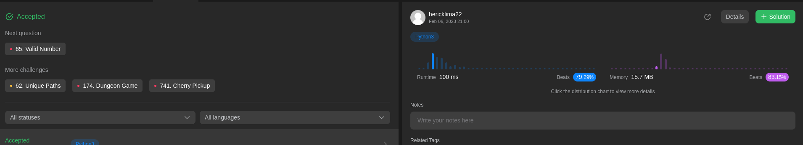

# Exercícios Resolvidos - Dupla 08

**Número da Lista**: 5 
**Conteúdo da Disciplina**: Programação Dinâmica 

## Alunos
|Matrícula | Aluno |
| -- | -- |
| 19/0054832  |  Arthur Talles de Sousa Cunha |
| 18/0121995 |  Herick de Carvalho Lima |

## Sobre 
Execução de exercícios associados ao tema Programação Dinâmica.

## Sumissões

### Longest Increasing Subsequence

### Triangle

### Coin Change

### Minimum Path Sum

### Maximum Product Subarray

## Descrição dos Problemas
### Longest Increasing Subsequence

Disponível em: https://leetcode.com/problems/longest-increasing-subsequence/description/

### Triangle
Disponível em: https://leetcode.com/problems/triangle/description/

### Coin Change
Disponível em: https://leetcode.com/problems/coin-change/description/

### Minimum Path Sum
Disponível em: https://leetcode.com/problems/minimum-path-sum/description/

### Maximum Product Subarray
Disponível em: https://leetcode.com/problems/maximum-product-subarray/description/

## Instalação 
**Linguagem**: Python 

O único pré-requisito para rodar os códigos é possuir a linguagem python instalada.

