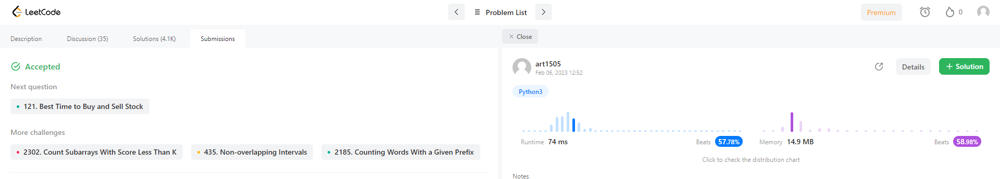

# Exercícios Resolvidos - Dupla 08

**Número da Lista**: 5 
**Conteúdo da Disciplina**: Programação Dinâmica 

## Alunos
|Matrícula | Aluno |
| -- | -- |
| 19/0054832  |  Arthur Talles de Sousa Cunha |
| 18/0121995 |  Herick de Carvalho Lima |

## Sobre 
Execução de exercícios associados ao tema Programação Dinâmica.

## Sumissões

### Longest Increasing Subsequence

### Triangle

## Descrição dos Problemas
### Longest Increasing Subsequence

Disponível em: https://leetcode.com/problems/longest-increasing-subsequence/description/

### Triangle
Disponível em: https://leetcode.com/problems/triangle/description/
## Instalação 
**Linguagem**: xxxxxx 
**Framework**: (caso exista) 
Descreva os pré-requisitos para rodar o seu projeto e os comandos necessários.

## Uso 
Explique como usar seu projeto caso haja algum passo a passo após o comando de execução.

## Outros 
Quaisquer outras informações sobre seu projeto podem ser descritas abaixo.

